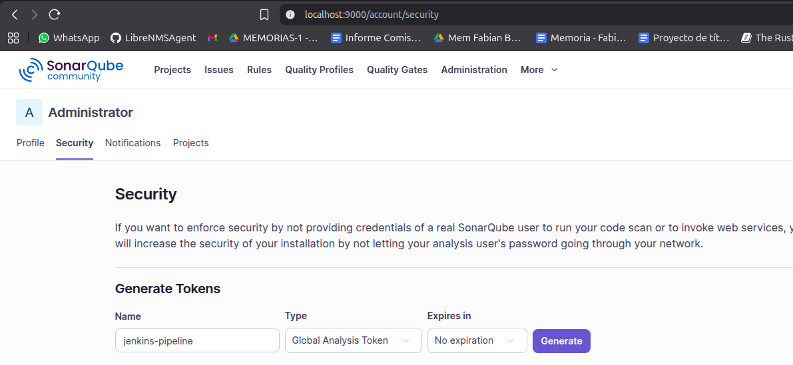
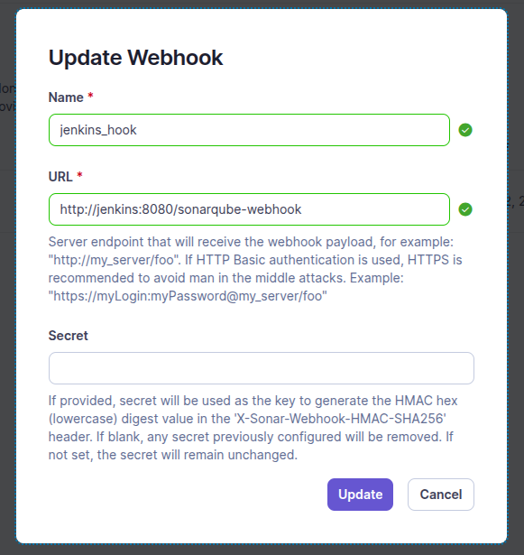
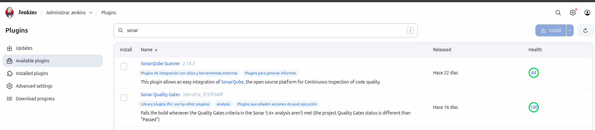
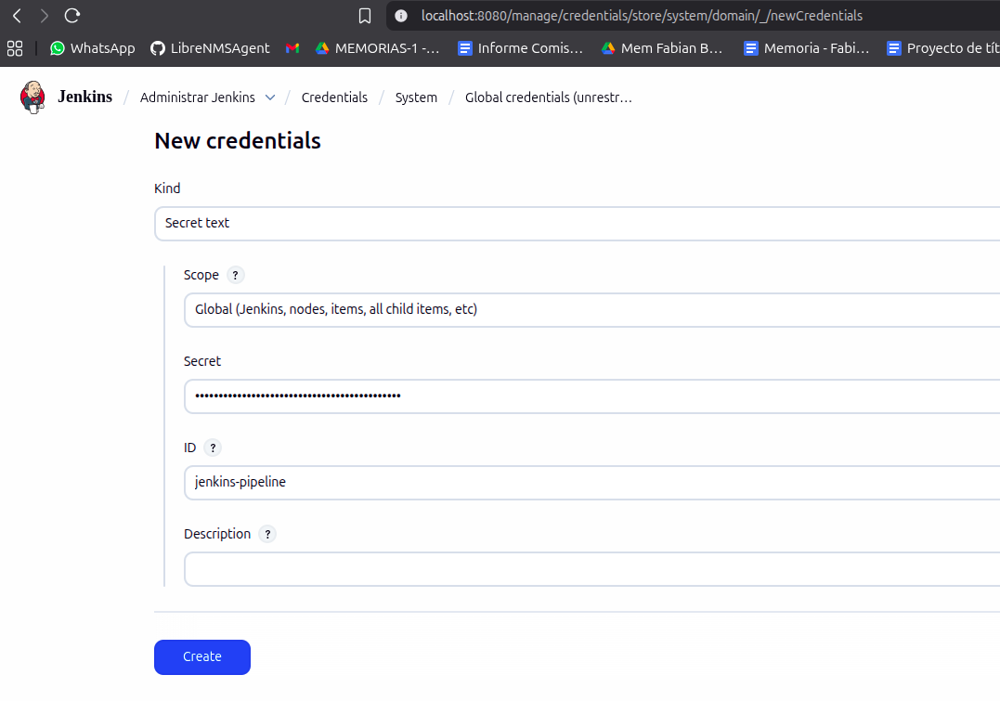
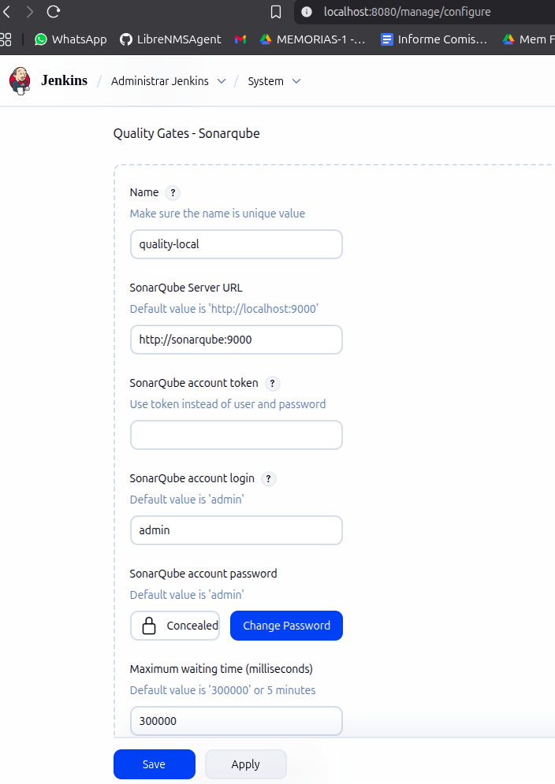
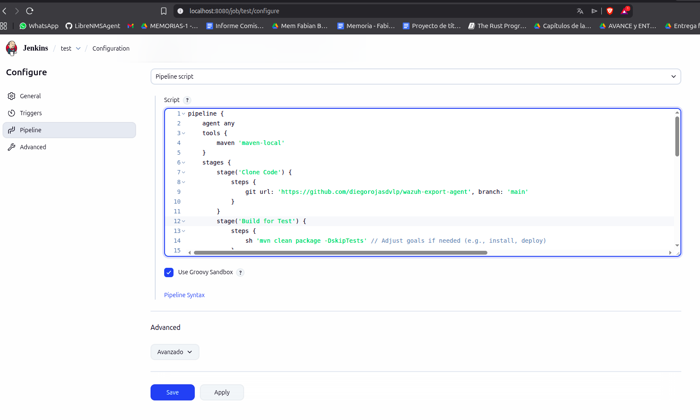

# DevSecOps HUB

## 🛠️ Requisitos Minimos
- Docker Engine (con Docker Desktop o Docker CLI)
- 4 CPU Limit
- 4 GB Memory Limit
- 1 GB Swap Memory
- 10 GB Disk Limit

## 🛠️ Como instalar el pipeline

1.  Navegar al directorio del pipeline:
    ```bash
    cd ./pipeline
    ```
2.  Instalar los contenedores del pipeline con Docker Compose:
    ```bash
    docker compose up -d
    ```
3.  Verificar que todos los contenedores estén activos:
    - Jenkins (jenkins)
    - SonarQube (sonarqube)
    - Base de datos de SonarQube (postgres)
    - Zaproxy (owasp-zap)

## 🎯 Iniciar SonarQube

### Configuración inicial
- Acceder a: `http://localhost:9000`
- Credenciales iniciales: `admin / admin`
- Cambiar y recordar credenciales al primer inicio.

### Creación de token para Jenkins
1.  Ir a **Profile > My Account > Security**
2.  Generar un nuevo token con el nombre: `jenkins-pipeline`
3.  Copiar y guardar el token para su uso posterior.



### Configuración de Webhook para Quality Gates
1.  Crear un proyecto en SonarQube.
2.  Ir a **Project Settings > Webhooks**
3.  Agregar nuevo webhook:
    - **Name**: `jenkins_hook`
    - **URL**: `http://jenkins:8080/sonarqube-webhook`



## 🔍 Iniciar Zaproxy (OWASP ZAP)

> **Pendiente de configuración**

## 🚀 Iniciar Jenkins

### Acceso inicial
1.  Ejecutar shell del contenedor:
    ```bash
    docker exec -it jenkins /bin/bash
    ```
2.  Obtener la contraseña inicial:
    ```bash
    cat /var/jenkins_home/secrets/initialAdminPassword
    ```
3.  Salir del contenedor e ingresar en: `http://localhost:8080`
4.  Completar el setup inicial:
    - Pegar contraseña incial en campo requerido
    - Instalar plugins sugeridos (Recomendado)

    
    - Crear usuario administrador

    

### Configuración de herramientas

#### Maven
- Ir a **Managed Settings > Tools > Maven**
- Agregar instalación con nombre: `maven-local`


#### Plugins de SonarQube
- Ir a **Plugins > Available plugins**
- Descargar plugins:
  - **SonarQube Scanner**
  - **Sonar Quality Gates**



> ⚠️ Reiniciar Jenkins tras la instalación.

#### SonarQube Scanner
- Ir a **Tools > SonarQube Scanner**
- Agregar instalación con nombre: `sonar-scanner`


### Credenciales
- Ir a **Credentials > System > Global Credentials**
- Crear credencial tipo **Secret text**:
  - **ID**: `sonar-token`
  - **Secret**: (insertar token generado en SonarQube)
  - **Name**: (insertar nombre token generado en SonarQube) 



### Configuración del servidor SonarQube
- Ir a **System > SonarQube servers**
- Agregar servidor:
  - **Name**: `sonar-local`
  - **URL**: `http://sonarqube:9000`
  - **Server Auth**: Seleccionar credencial `jenkins-pipeline`

### Configuración del Quality Gate
- Ir a **System > Quality Gates - SonarQube**
- Agregar servidor:
  - **Name**: `quality-local`
  - **URL**: `http://sonarqube:9000`
  - **Token**: (insertar token generado en SonarQube) o user/pass SonarQube
  - **Max waiting time**: `300000`
  - **Time to wait next check**: `15000`



### Creación del Pipeline (Job)
1.  Ir a **Home > New Item**
2.  Tipo: **Pipeline**


3.  En **Pipeline Script**, pegar contenido de `jenkins/jenkinsfile`



4.  Guardar y ejecutar con **Build Now**


## 📦 Estructura de contenedores

> Detalles de la arquitectura Docker Compose pendientes.

## 💻 Comandos Importantes

- Iniciar servicios: `docker compose up -d`
- Ver logs: `docker logs <container_name>`
- Acceder a Jenkins: `docker exec -it jenkins /bin/bash`
- Reiniciar Jenkins: `docker restart jenkins`

